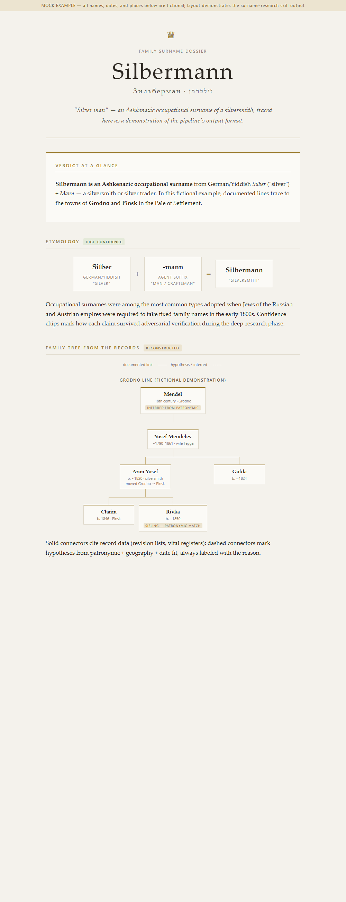

# surname-research

A [Claude Code](https://claude.com/claude-code) skill that researches a family surname end-to-end and produces a designed, cited HTML dossier — etymology, geographic origin, real archival records, reconstructed family trees, and (when the trail allows) the user's own documented direct line.

> All screenshots and examples in this repo use **fictional data** (surname "Silbermann"). The skill itself works on any surname; it is strongest for Ashkenazi / Eastern-European names because of its JewishGen integration.



## What it does

Five phases, each feeding the next:

| Phase | What happens | Output |
|---|---|---|
| 1. Deep web research | Multi-agent fan-out over etymology, origin, notable bearers, variant spellings — every claim adversarially verified | verified findings + sources |
| 2. HTML dossier | Archival-dossier design (parchment/gold, serif, confidence chips), optional trilingual EN/HE/RU switcher, optional AI hero image, PDF export | `<surname>-report.html` |
| 3. Archive search | Drives the user's Chrome through JewishGen's Unified Search: revision lists, vital records, voter lists, business directories, burial registries, Holocaust datasets — with all the site's quirks encoded | `<surname>-records.md` |
| 3b. WW2 soldier records | For USSR ancestors born ~1895–1925: pamyat-naroda.ru URL-driven search — award citations (scanned feat descriptions), officer/navy/wound cards, evacuation traces. A soldier's patronymic names his father, bridging the post-1911 civil-register gap | soldier files + one more generation |
| 4. Trees & chain-tracing | Reconstructs family nests per town; links records **across databases and cities** via patronymic + birth-year + spouse-name matching; solid = documented, dashed = labeled hypothesis | family-tree sections |
| 5. Fold-in | Findings merged back into the dossier; follow-up map (Yad Vashem, WW2 records, archive scans, emigration trails); skill self-updates with new pitfalls | updated report + next steps |

## Why it's more than a prompt

The skill encodes **hard-won operational knowledge** that would otherwise burn hours per session:

- JewishGen's login/profile/review gates and which databases each gate blocks
- Popup-blocker-proof form submission (`HTMLFormElement.prototype.submit` — the site shadows `.submit`), tightest-row selection in nested result tables
- Phonetic-search noise filtering (how to spot an unrelated family by patronymic style)
- **Chain-tracing**: matching a birth record in one city to a death record in another decades later — how Pale-of-Settlement families are actually followed to Kiev/Kharkov/Odessa
- The ~1911 civil-register horizon and how to state the gap to living generations honestly
- CSS-only family trees (no libraries — artifact CSP-safe), RTL Hebrew layout rules, headless-Chrome PDF export

## Install

Copy `SKILL.md` into your personal Claude Code skills directory:

```
~/.claude/skills/surname-research/SKILL.md
```

Then in any project: *"research the surname X"* — or invoke `/surname-research`.

Requirements: Claude Code with the Claude-in-Chrome extension (for the archive phases), a free JewishGen account (the skill walks the user through registration), optionally a text-to-image API key for hero images.

## How to use — a real session's shape

1. **"Research my surname X"** → deep web research + designed dossier (etymology, origins, notable bearers).
2. **Archive phase** → grant the Chrome extension access to jewishgen.org; log in when asked (the skill never touches your password). Records land in `<surname>-records.md`, trees in the report.
3. **Feed it family memory** → one fact ("grandfather born in city Y in 1921") re-anchors the whole search. Expect memory to be *approximately* right — the skill checks variant dates/spellings.
4. **WW2 phase** (USSR families) → grant access to pamyat-naroda.ru; give name + patronymic + rough birth year. You will be asked to solve the site's CAPTCHA yourself — the assistant won't. Award citations, wound cards, and unit rosters come back with the father's name inside the patronymic.
5. **Living relatives** → JewishGen Family Finder matches (after their ~24h profile review) and soldier-photo galleries point at people researching the same line. Contacting them is always your explicit decision.
6. **Iterate** — each answer you give ("his father was Boris", "the family was in Perm during the war") gets folded back into the report and trees, all languages, same artifact URL.

What it will NOT do: enter passwords, solve CAPTCHAs, message people without your approval, or present a hypothesis as documented — every uncertain tree edge stays dashed and labeled.

## Repo layout

```
SKILL.md                     # the skill — pipeline + pitfalls
examples/mock-report.html    # fictional dossier demonstrating the output design
docs/screenshots/            # renders of the mock example
```

## Honesty rules baked in

- Every tree edge is either **documented** (cites a record) or **dashed + labeled** with the inference reason
- Etymology without a direct dictionary entry is labeled as inference from sibling surnames
- Claims that fail adversarial verification are excluded and listed as refuted
- Record gaps (e.g. post-1911) are stated, never papered over

## License

MIT
